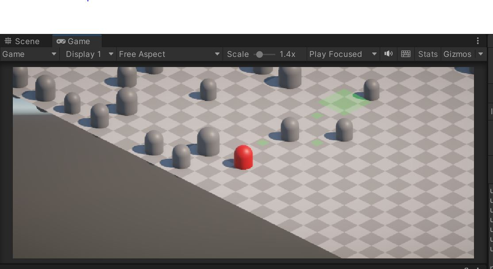

# Grid-Based Pathfinding in Unity

TL;DR; - procedurally generate a grid over a Terrain with Trees (grid not visible). Grid-based / tile-by-tile movement with pathfinding for the player.

Using the Gridyfy script on the CustomGrid object, a grid with "trees" can be procedurally generated over the given Terrain in Editor Mode. 
Tree prefabs can be added to a predefined list. 
The path is calculated on the grid to check if a given tile is walkable(no tree). By using a Tile game object and class, the tile can be expanded with additional properties. 
Path and target tile markers are rendered using meshes. 

Disclaimer:
This is by far not a finished or optimized version, but rather gathering code from different places. 
Use this to kickstart or get ideas. 

